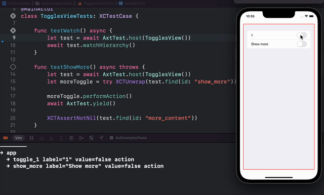

# 🪓 Axt 

Axt is SwiftUI view testing library. It makes use of preferences to enable testing views.



## Examples

Take a simple views that displays a number of toggles:

```swift
List {
    Toggle("1", isOn: $value1)
        .axt(.toggle, "toggle_1")
    Toggle("Show more", isOn: $showMore)
        .axt(.toggle, "show_more")
    if showMore {
        Toggle("2", isOn: $value2)
            .axt(.toggle, "toggle_2")
    }
}
```

### Watching the hierarchy

We can watch view updates in the console:

```swift
func testWatch() async {
    let test = await AxtTest.host(TogglesView())
    await test.watchHierarchy()
}
```

### Check for a value

We can check the value of a toggle:

```swift
let test = await AxtTest.host(TogglesView())
let moreToggle = try XCTUnwrap(test.find(id: "show_more"))

moreToggle.performAction()
await AxtTest.yield()

XCTAssertNotNil(test.find(id: "more_content"))
```

### Perform an action 

We can programmatically tap the toggle in the test:

```swift
let test = await AxtTest.host(TogglesView())
let moreToggle = try XCTUnwrap(test.find(id: "show_more"))
moreToggle.performAction()
```

### Wait for a condition

We can wait for a toggle to appear:

```swift
try await test.waitForCondition(timeout: 1) {
    test.find(id: "toggle_2") != nil
}
```

Check out more examples in the AxtExamples project in the Examples folder.

## Getting started

1. Add the Axt Swift package as a dependency to your Xcode project.
2. Link both your app target and unit test target to the Axt library. If the project is built for release, it will only contain stubs for Axt and no inspection code.
3. Make sure your unit test target has a host application. We need some app to host the views to test, but the views do not need to be part of this host application.

## Documentation

### Exposing views

#### Native views

Because we cannot change native SwiftUI view implementations and add preferences to them, we need a different way to expose their information. To enable Axt on native SwiftUI views, you need to give Axt a hint as to what kind of view it needs to look for:

```swift
Button("Tap me") { tap() }
    .axt(.button, "tap_button")

Toggle("Tap me", isOn: $isOn)
    .axt(.toggle, "is_on_toggle")

NavigationLink("More", destination: Destination())
    .axt(.navigationLink, "more_link")

TextField("Name", text: $name)
    .axt(.textField, "name_field")
```

You can place the `axt` modifier below other modifiers as well:

```swift
Button("Tap me") { tap() }
    .buttonStyle(MyButtonStyle())
    .tint(.red)
    .axt(.button, "tap_button")
```

